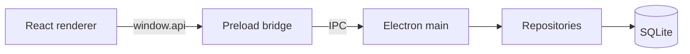

# House Budget

A local-first, zero-based budgeting app for households. Plan every unit of income into groups and items each month, log what you actually spend, and see where the money went, all on your own machine with no accounts, no cloud, and no subscriptions.

House Budget is a desktop app built with Electron, React, and SQLite. Your data lives in a single SQLite file on your computer and never leaves it.

## Why House Budget

- **Zero-based budgeting** — every month you give every unit of income a job until income minus allocations reaches zero.
- **Built for households** — track income per member, and plan funding across multiple bank accounts (main, joint, wallet, savings).
- **Local-first and private** — no sign-up, no telemetry, no network calls. The whole budget is one SQLite file you own.
- **Plan vs. actual** — record individual spending entries against each item and watch the difference update live.
- **History and dashboard** — review past months and visualise trends with built-in charts.
- **Safe by default** — automatic backups on close (when enabled) plus on-demand snapshots.

## Requirements

- [Node.js](https://nodejs.org/) 18 or newer (includes npm)
- Windows is the primary target (the packaged build ships an NSIS installer). The app also runs from source on macOS and Linux.
- A C/C++ toolchain is needed once to compile the native `better-sqlite3` module (Visual Studio Build Tools on Windows, Xcode CLT on macOS, `build-essential` on Linux).

## Installation

```bash
git clone https://github.com/JoseSilva1997/house_budget.git
cd house_budget
npm install
```

If the native SQLite module needs rebuilding against Electron's Node version:

```bash
npm run rebuild
```

## Quickstart

Run the app in development mode (compiles the main process, starts the renderer bundler in watch mode, and launches Electron):

```bash
npm run dev
```

After editing a renderer file (`.jsx`), save and press <kbd>Ctrl</kbd> + <kbd>R</kbd> in the app window to reload. Editing main-process TypeScript requires restarting `npm run dev`.

To run a one-off production-style build and launch:

```bash
npm start
```

On first launch the app creates an empty SQLite database under your user data folder, then you can add household members, create your first month, and start allocating.

## Usage

The app has four screens, reachable from the sidebar:

- **Dashboard** — an at-a-glance overview with charts (powered by Recharts).
- **Month Budget** — the core view: income by member, then allocation groups and items, with allocated / actual / difference columns. Open the **Wallet** drawer to plan funding by bank account.
- **History** — browse and reopen previous months.
- **Settings** — manage household members, bank accounts, currency, theme (12 dark palettes), and backups.

A typical monthly flow:

1. Create a new month from **Month Budget → New month**.
2. Enter each household member's income for the month.
3. Add groups (for example House, Food, Savings) and items within them, giving each a planned amount.
4. As money is spent, log actual entries against the relevant items.
5. Check the **difference** column to keep the month balanced.

## Configuration

There is nothing to configure to get started, the app works out of the box. Preferences such as currency, theme, household members, bank accounts, and backup behaviour are all managed in the **Settings** screen and stored in the database.

### Data and backups

All data is stored under Electron's per-user data directory:

- `data/budget.sqlite` — the live database.
- `backups/` — dated database snapshots.

The exact location is printed to the console at startup (`[house-budget] userData: …`). When auto-backup is set to "on close", the app writes a snapshot when you quit (an empty, never-used database is skipped). You can also take manual backups from **Settings**.

## Building a distributable

```bash
npm run pack   # unpacked build into release/ (for testing)
npm run dist   # full installer (Windows NSIS) into release/
```

## Development

| Command | Description |
|---------|-------------|
| `npm run dev` | Full dev loop: build main/preload, watch-build the renderer, launch Electron. |
| `npm run build` | Compile main + preload TypeScript (`tsc`). |
| `npm run build:renderer` | Bundle the renderer with esbuild. |
| `npm run watch:renderer` | Rebuild the renderer on save. |
| `npm run rebuild` | Rebuild the native `better-sqlite3` module for Electron. |
| `npm start` | Build everything, then launch Electron. |

### Project structure

```
main/        Electron main process: entry point, DB init, IPC handlers
preload/     Context-isolated bridge exposing window.api to the renderer
renderer/    React UI (screens, components, store, lib helpers)
database/    SQL schema, triggers, migrations, repositories, conversions
scripts/     Build, dev, icon, and native-rebuild helpers
```

### Architecture



The renderer never touches the database directly. It calls atomic methods on `window.api`, which the context-isolated preload forwards over IPC to handlers in `main/ipc`. Those handlers go through repositories in `database/` that read and write the SQLite file. Monetary values are stored as integer cents to avoid floating-point error.

### Schema and migrations

The committed `database/schema.sql` and `database/triggers.sql` are the baseline (version 1). Schema changes are append-only, numbered migrations in `database/migrations.ts`, applied automatically on startup via SQLite's `PRAGMA user_version`. Never edit a shipped migration, add a new one.

## Contributing

Issues and pull requests are welcome. To get set up, follow [Installation](#installation), then run `npm run dev`. When changing the database schema, add a new migration rather than editing the baseline or an existing migration.

## License

[MIT](LICENSE)
